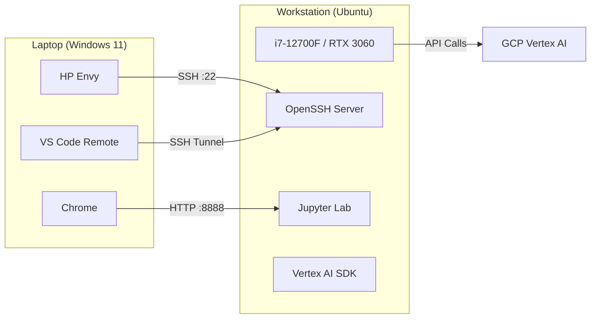

# System Architecture

## Overview
The workstation is designed to be flexible, supporting both "at-the-desk" graphical usage and "remote" headless usage.

## 1. GUI Mode (Local)
- **Primary Interface:** GNOME Desktop on Ubuntu 24.04.
- **Usage:** Coding in VS Code, web browsing, data visualization, and system monitoring.
- **Hardware Access:** Direct attached monitors, keyboard, mouse.

## 2. SSH Remote Mode (Laptop Client)
- **Client:** Windows 11 HP Envy.
- **Connection:** SSH over local network (LAN) and potentially via Tailscale for WAN access (future).
- **Usage:**
    - VS Code Remote - SSH extension for development.
    - Jupyter Lab tunneling for notebooks.
    - Job submission scripts.

## Network Diagram

