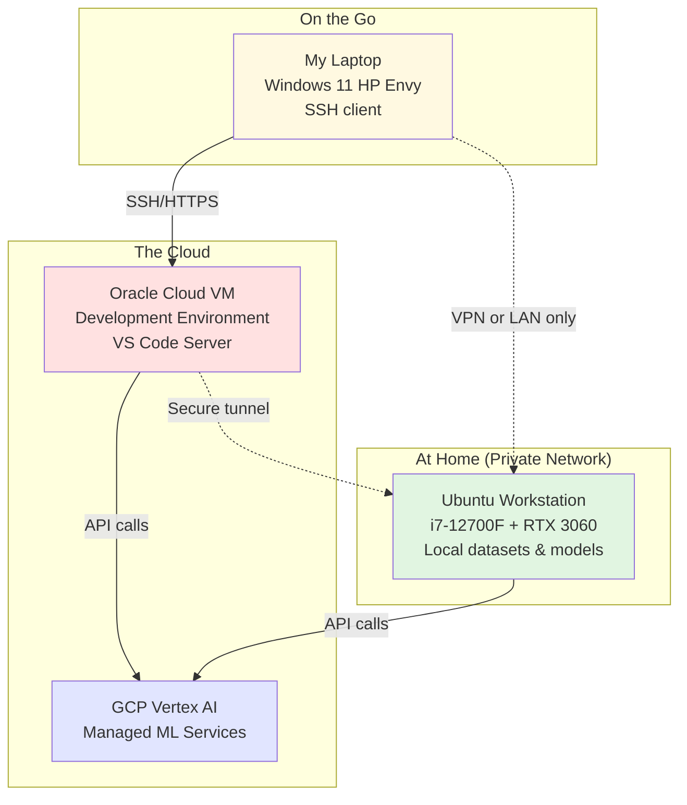

# System Architecture: How Everything Connects

## The Big Picture

I'm running a **hybrid setup** where different parts of my workflow live in different places. Think of it as splitting the "brain" (where I write code) from the "muscle" (where heavy computation happens).

## The Three Pieces

### 1. Oracle Cloud VM (My Development Environment)

**What it is:** A virtual machine running in Oracle's data center.

**What I use it for:**

- Writing and editing code
- Running my IDE (VS Code Server or JetBrains Gateway)
- Testing and debugging

**Why in the cloud?**

- I can access it from anywhere (coffee shop, library, campus)
- It's always on, even when my laptop is closed
- Costs me nothing (using free Oracle credits until Jan 28, 2026)

**Specs:** 4-8 virtual CPUs, 24GB+ RAM

### 2. My Ubuntu Machine (The Workhorse)

**What it is:** The physical gaming PC sitting at home.

**What I use it for:**

- Training machine learning models (using the RTX 3060 GPU)
- Running inference on trained models
- Storing datasets and project files

**Why keep it local?**

- GPU compute is expensive in the cloud—I already own this one
- Full control over my data (nothing leaves my home network)
- No monthly bills for storage or compute time

**Security:** This machine is **not** directly accessible from the internet. It only accepts connections from devices on my home network or through a secure VPN tunnel.

**Specs:** Intel i7-12700F, RTX 3060 (12GB), 1TB SSD

### 3. GCP Vertex AI (When I Need to Scale)

**What it is:** Google Cloud's managed machine learning platform.

**What I use it for:**

- Large-scale model training
- Production ML pipelines
- Managed services (AutoML, Model Garden)

**Why GCP?**

- Industry-standard platform for ML
- I have $1,000 in Vertex AI credits to experiment with
- Good for resume/portfolio to show I can work with managed services

## How They Work Together

## Real-World Example

Here's what a typical workflow looks like:

1. **Writing code:** I'm at a coffee shop. I open my laptop, SSH into my Oracle Cloud VM, and write code in VS Code Server.

2. **Testing locally:** I want to test something with my GPU. From the Oracle VM, I create a secure tunnel to my home Ubuntu machine and kick off a training job.

3. **Scaling up:** The model works! Now I want to train it on a bigger dataset. I use the GCP Vertex AI SDK (from either the Oracle VM or my home machine) to submit a training job to Google's infrastructure.

4. **Results:** The trained model gets saved to cloud storage. I can pull it down to my home machine for local inference, or deploy it using GCP's serving infrastructure.

## Why This Architecture?

**For learning:**

- Hands-on experience with multiple cloud providers (Oracle, GCP)
- Understanding hybrid cloud setups (common in enterprise)
- Real networking and security practice

**For cost:**

- Using free credits instead of paying out of pocket
- Leveraging hardware I already own
- Only paying for cloud resources when I actually need them

**For security:**

- My home machine never exposes ports to the internet
- Sensitive data stays on my private network
- Cloud VMs can be destroyed and recreated without losing local data
